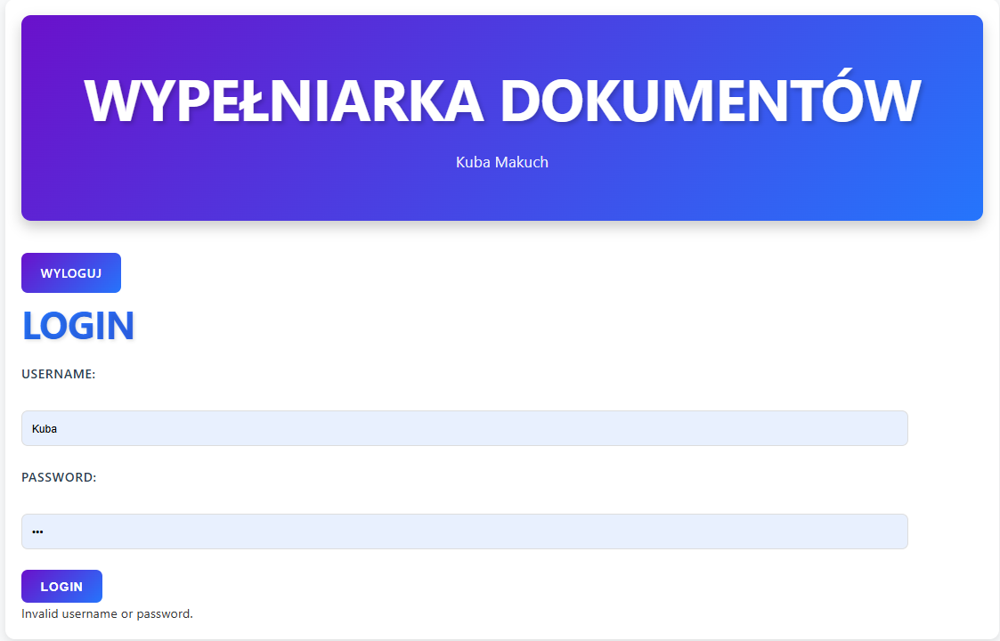
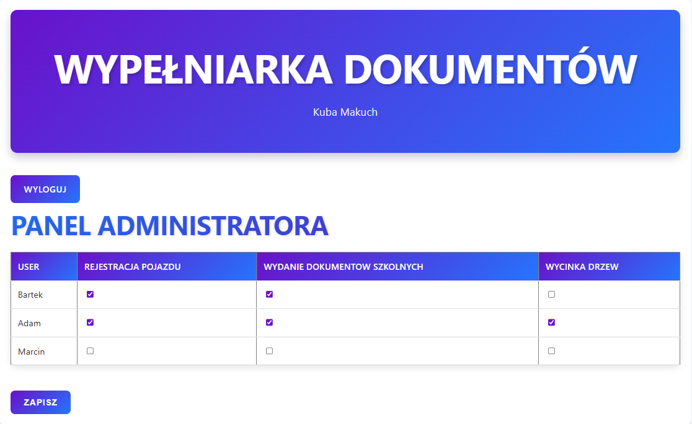
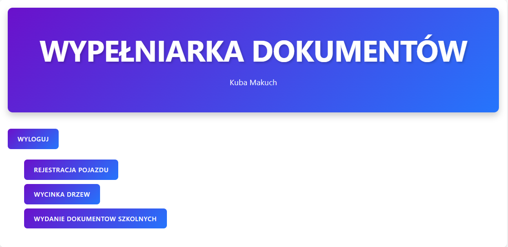
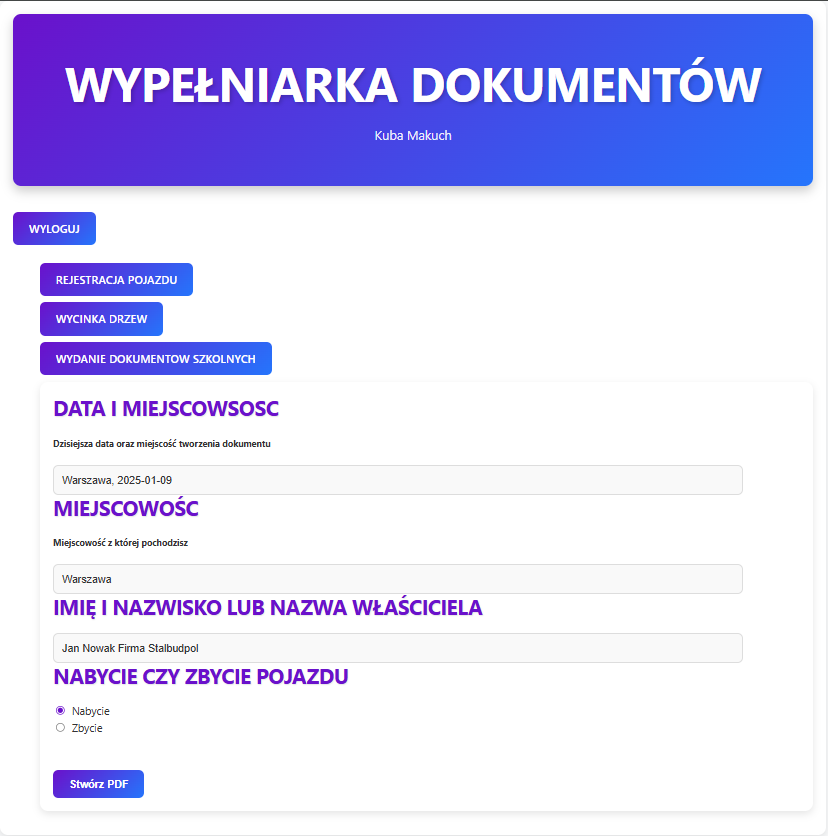
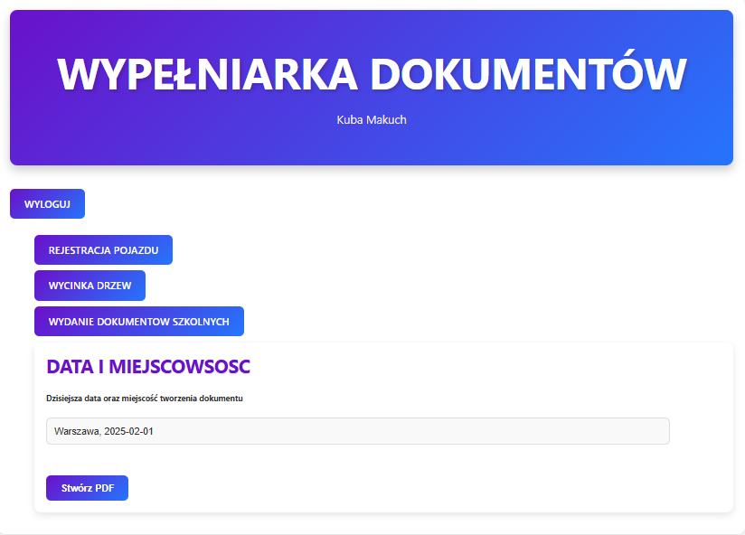
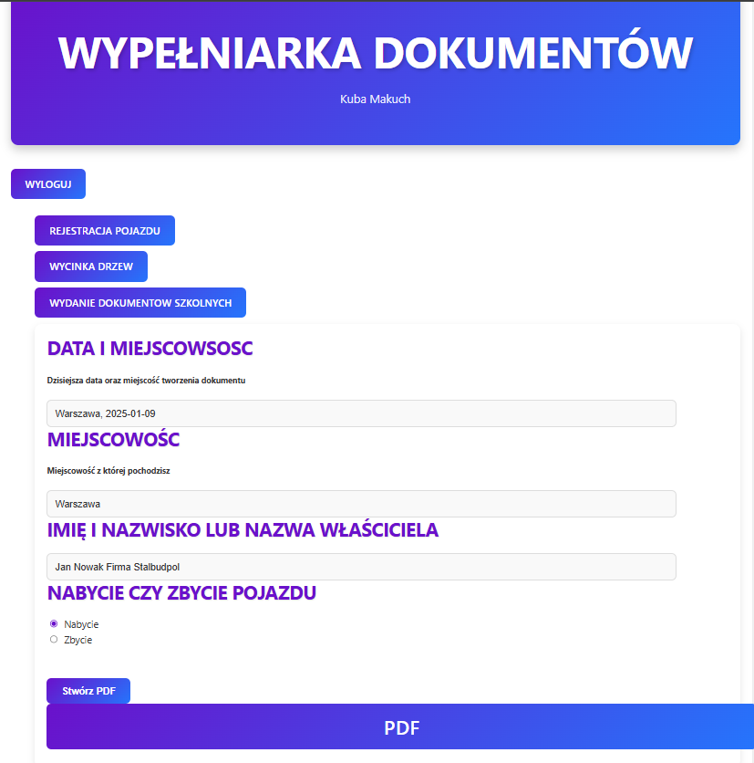

### Opis Strony
Strona internetowa umożliwia użytkownikom zarządzanie dostępem do dokumentów oraz ich przeglądanie w zależności od przydzielonych uprawnień. Administrator ma możliwość przypisywania lub odbierania dostępu do dokumentów dla poszczególnych użytkowników poprzez panel administracyjny. Zwykli użytkownicy mogą przeglądać jedynie dokumenty, do których mają dostęp.

### Wygląd
Po wprowadzeniu zmian w wyglądzie finalna wersja różni się od wersji planowanej w widokach na początku projektu zostały zaproponowane inne kolory pól jak również styl czcionki. Zmiany nie wpłyneły jednak na planowany układ stron.

### Zasady Programowania SOLID
Strona została zaprojektowana zgodnie z zasadami SOLID, co zapewnia przejrzystość, łatwość rozbudowy i utrzymania kodu:

    Single Responsibility Principle (SRP)
    Każda klasa ma tylko jedno odpowiedzialne zadanie:
        Page odpowiada za generowanie szkieletu strony.
        AdminPage obsługuje panel administracyjny.
        UserPage obsługuje stronę użytkownika.
        UserData zajmuje się interakcją z bazą danych.

    Open/Closed Principle (OCP)
    Kod można rozszerzać o nowe funkcjonalności (np. dodanie nowych dokumentów) bez potrzeby modyfikowania istniejących klas.

    Liskov Substitution Principle (LSP)
    Klasy AdminPage i UserPage dziedziczą po Page i mogą być używane w zamian bez zmiany zachowania.

    Interface Segregation Principle (ISP)
    Kod został podzielony na mniejsze klasy i metody, co pozwala uniknąć zbyt dużych, uniwersalnych interfejsów.

    Dependency Inversion Principle (DIP)
    Klasa UserData korzysta z abstrakcyjnego połączenia z bazą danych (PDO), co pozwala na łatwą zmianę źródła danych.

### Struktura Bazy Danych

Baza danych składa się z dwóch głównych tabel i jednej pomocniczej:

    users
    Przechowuje dane użytkowników:
        id – unikalny identyfikator.
        name – imię użytkownika.
        password – hasło użytkownika (zaszyfrowane).
        role – rola użytkownika (1 = administrator, 2 = zwykły użytkownik).

    user_documents_access
    Przechowuje informacje o dostępie użytkowników do dokumentów:
        user_id – identyfikator użytkownika (klucz obcy z tabeli users).
        document_key – identyfikator dokumentu.

Relacje Między Tabelami

    users jest powiązana z user_documents_access przez pole user_id.
    Dzięki temu możliwe jest przypisanie dostępu do konkretnych dokumentów poszczególnym użytkownikom.

### Jak Działa Logowanie

    Użytkownik wprowadza swoje dane logowania (nazwa i hasło).
    System sprawdza poprawność danych w tabeli users.
    Po zalogowaniu:
        Jeśli użytkownik ma rolę 1 (administrator), zostaje przekierowany do panelu administracyjnego.
        Jeśli użytkownik ma rolę 2 (zwykły użytkownik), widzi listę dokumentów, do których ma dostęp.

Logowanie opiera się na sesjach, co pozwala utrzymać stan zalogowania użytkownika przez czas trwania jego wizyty na stronie.

### Uruchamianie
W celu uruchomienia projektu należy:
- Wszystkie pliki wlożyć do folderu który znajduje się na serwerze php.
- Stworzyć bazę danych "wypelniarka_dokumentow3"
- Wykonać na tej bazie wszystkie polecenia MySQL z pliku wypelniarka_dokumentow.sql
- Jeżeli wymaga tego baza, zmienić dane do logowania w pliku "php/UserData.php" w konstruktorze klasy.

### Testy
    Test logowania zwykłego użytkownika
        Loguje użytkownika „Adam” (rola 2).
        Test przechodzi, jeśli sesja zawiera poprawne dane użytkownika.

    Test wylogowania
        Sprawdza, czy użytkownik zostaje wylogowany po uruchomieniu funkcji Logout().
        Test przechodzi, jeśli sesja zostaje wyczyszczona.

    Test logowania admina
        Loguje użytkownika „Kuba” (admin, rola 1).
        Test przechodzi, jeśli sesja zawiera poprawne dane admina.

    Test połączenia z bazą danych
        Sprawdza, czy można nawiązać połączenie z bazą danych.
        Jeśli połączenie nie powiedzie się, test zwraca błąd.

    Test pobierania użytkowników
        Sprawdza, czy funkcja zwraca listę użytkowników.
        Test przechodzi, jeśli w bazie istnieją użytkownicy.

    Test nadawania dostępu do dokumentu
        Nadaje dostęp użytkownikowi do konkretnego dokumentu.
        Test przechodzi, jeśli użytkownik ma dostęp po wykonaniu funkcji.

